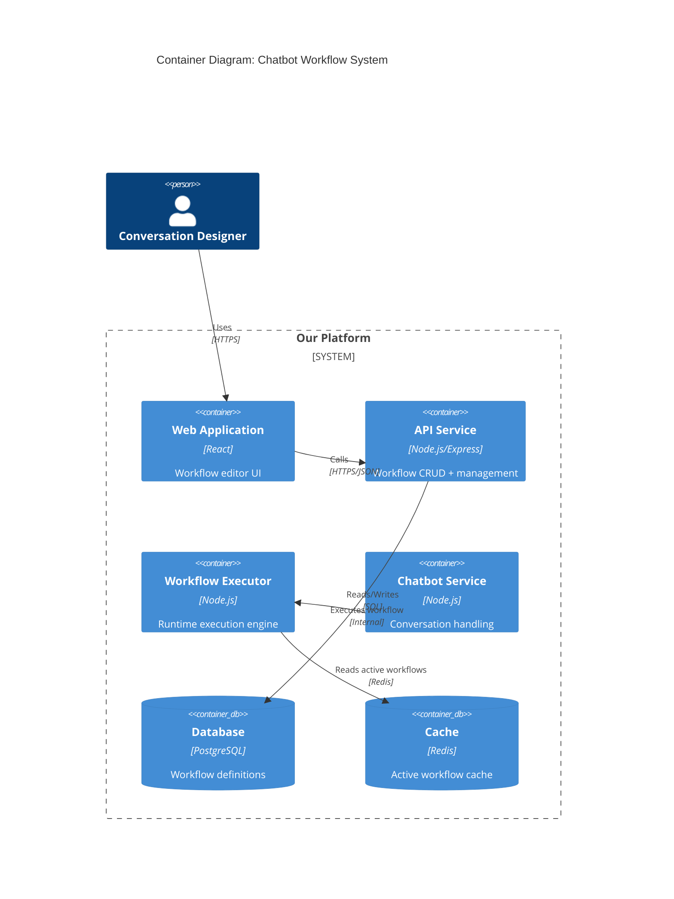

# Vibe Ship Small

> **Version**: 0.1.0

A team collaboration guide for AI-assisted development that prevents massive PRs through structured planning.

## The Problem

When teams use AI agents (Claude Code, Cursor, Cline, Bolt) for "vibe coding," the PRs get massive. A single feature request can generate 5,000+ lines of changes that are impossible to review effectively. This creates:

- **Review bottlenecks** - No one wants to review a 10k line PR
- **Hidden bugs** - Large diffs hide issues in the noise
- **Merge conflicts** - Big PRs sit open longer, increasing conflict risk
- **Knowledge silos** - Reviewers skim instead of understanding

## The Solution

**Ship small, even when vibe coding.**

This repo provides a structured workflow that decomposes features *before* agents start coding, ensuring each PR stays in the 200-400 line sweet spot.

```
PRD (What/Why) → Spec (How) → Task Breakdown → Small PRs
```

---

## Quick Start

### For Ticket Creation (Planning)

1. **Write a PRD** using [`templates/prd-template.md`](templates/prd-template.md)
   - Define the problem, user stories, and non-goals
   - Get stakeholder alignment before technical work

2. **Write a Technical Spec** using [`templates/spec-template.md`](templates/spec-template.md)
   - Add C4 architecture diagrams (Mermaid)
   - Break work into tasks targeting ~200-400 lines each
   - Map dependencies between tasks

3. **Create Jira Tickets** from the spec's task breakdown
   - One task = one PR
   - Link each ticket back to the spec

### For PR Review (Reviewing)

1. **Check PR size** - Warn if >400 lines, block if >800
2. **Verify spec link** - Every feature PR must link to its spec
3. **Review architecture first** - Look at C4 diagrams before code
4. **Use the PR template** from [`templates/pull-request-template.md`](templates/pull-request-template.md)

---

## Workflow Overview

```
┌─────────────────────────────────────────────────────────────────────┐
│                        TICKET PLANNING                               │
├─────────────────────────────────────────────────────────────────────┤
│                                                                      │
│  ┌──────────┐    ┌──────────┐    ┌──────────┐    ┌──────────┐      │
│  │   PRD    │───▶│   Spec   │───▶│  Tasks   │───▶│  Jira    │      │
│  │ (What)   │    │  (How)   │    │ (Work)   │    │ Tickets  │      │
│  └──────────┘    └──────────┘    └──────────┘    └──────────┘      │
│       │               │               │                              │
│       ▼               ▼               ▼                              │
│  User Stories    C4 Diagrams    ~200-400 lines                      │
│  Non-Goals       Data Model     per task                            │
│  Success KPIs    API Design                                         │
│                                                                      │
└─────────────────────────────────────────────────────────────────────┘

┌─────────────────────────────────────────────────────────────────────┐
│                        PR REVIEW                                     │
├─────────────────────────────────────────────────────────────────────┤
│                                                                      │
│  ┌──────────┐    ┌──────────┐    ┌──────────┐    ┌──────────┐      │
│  │  Size    │───▶│  Spec    │───▶│   C4     │───▶│  Code    │      │
│  │  Check   │    │  Link    │    │ Diagram  │    │ Review   │      │
│  └──────────┘    └──────────┘    └──────────┘    └──────────┘      │
│       │               │               │               │              │
│       ▼               ▼               ▼               ▼              │
│  < 400 lines?   Context for      Architecture     Implementation    │
│                 reviewer         changes first    details second    │
│                                                                      │
└─────────────────────────────────────────────────────────────────────┘
```

---

## Example: Ticket Planning

Let's walk through planning a "Custom Chatbot Workflows" feature.

### Step 1: Write the PRD

See full example: [`examples/prd-chatbot-workflows.md`](examples/prd-chatbot-workflows.md)

**Key sections:**

```markdown
## Problem Statement
Users need to customize how the chatbot responds to different scenarios,
but currently all conversation logic is hardcoded. This forces engineering
involvement for every business logic change.

## User Stories
As a conversation designer, I want to create and modify chatbot workflows
visually, so that I can launch new conversation patterns without engineering support.

## Non-Goals (Scope Fence)
- Version history / diff view - Track later based on usage
- Workflow analytics - Separate initiative after MVP
- A/B testing workflows - Requires experimentation platform
```

### Step 2: Write the Technical Spec

See full example: [`examples/spec-chatbot-workflows.md`](examples/spec-chatbot-workflows.md)

**C4 Container Diagram:**



**Task Breakdown:**

| ID | Task | Est. Lines | Dependencies |
|----|------|------------|--------------|
| T1 | Database migrations | ~100 | None |
| T2 | Workflow repository layer | ~200 | T1 |
| T3 | Workflow validation service | ~150 | T2 |
| T4 | List/Search API endpoint | ~150 | T2 |
| T5 | CRUD API endpoints | ~200 | T3 |
| T6 | Publish/Unpublish API | ~150 | T5 |
| T7 | Redis cache layer | ~100 | T6 |
| T8 | Workflow Matcher | ~150 | T7 |
| T9 | Execution Engine core | ~250 | T8 |
| T10 | Message node handler | ~80 | T9 |
| ... | ... | ... | ... |

**Total: 25 tasks, ~4,000 lines across 25 PRs (~160 lines average)**

### Step 3: Create Jira Tickets

Each task becomes a ticket:

```
Epic: Custom Chatbot Workflows
├── Story: Workflow Storage & Management
│   ├── Task: [T1] Create database migrations for workflows
│   ├── Task: [T2] Implement workflow repository layer
│   └── Task: [T3] Add workflow validation service
├── Story: Workflow API
│   ├── Task: [T4] Build list/search API endpoint
│   └── ...
```

---

## Example: PR Review Planning

When a PR comes in for task T5 (CRUD APIs), the reviewer should:

### 1. Check Size
```
✓ PR is 187 lines (target: 200-400)
```

### 2. Open the Spec Link
The PR links to `/docs/specs/chatbot-workflows.md#task-breakdown`

### 3. Review Architecture Context
From the spec, the reviewer sees:
- This task builds on T3 (validation) and T2 (repository)
- It's part of the API layer in the C4 diagram
- It should not touch the Executor or Cache layers yet

### 4. Review the Code
Now with full context, the reviewer can verify:
- Does it follow the patterns established in T2-T4?
- Does it use the validation service from T3?
- Does it stay within its architectural boundary?

### 5. Use the PR Template

```markdown
## Summary
Implements CRUD endpoints for workflow management.

## Spec Reference
**Spec**: `/docs/specs/chatbot-workflows.md`
**Task**: Completes task T5

## Changes Made
- POST /api/v1/workflows - Create workflow
- GET /api/v1/workflows/:id - Get workflow
- PUT /api/v1/workflows/:id - Update workflow
- DELETE /api/v1/workflows/:id - Archive workflow

## Checklist
- [x] PR is ≤ 400 lines
- [x] Spec link included
- [x] Tests added for all endpoints
- [x] Validation service used for all mutations
```

---

## Repository Structure

```
vibe-ship-small/
├── README.md                          # This file
├── TEAM-WORKFLOW-STANDARD.md          # Full process documentation
├── templates/
│   ├── prd-template.md                # PRD template
│   ├── spec-template.md               # Technical spec template
│   └── pull-request-template.md       # PR template for GitHub
├── examples/
│   ├── prd-chatbot-workflows.md       # Complete PRD example
│   ├── spec-chatbot-workflows.md      # Complete spec example
│   └── pr-example-chatbot-workflows.md # PR examples with task references
└── research/
    ├── Agent Communication Tools for Code.md
    ├── AI Planning and Architecture Prompt Search.md
    ├── Creating a Developer Cheat Sheet.md
    ├── PR-orchestration.md
    └── PRD-Task-Graph.md
```

---

## The 200-400 Line Rule

| PR Size | Action |
|---------|--------|
| < 200 lines | Good - might combine with related task |
| **200-400 lines** | **Ideal - reviewable in one sitting** |
| 400-800 lines | Warning - consider splitting |
| > 800 lines | Block - must decompose further |

---

## Alternative Approaches

Not every team needs the full process. See [TEAM-WORKFLOW-STANDARD.md](TEAM-WORKFLOW-STANDARD.md) for:

- **Lightweight Option**: Single "Design Doc" instead of PRD + Spec
- **ADR-Driven**: Document decisions as you go instead of upfront specs
- **Stacked PRs**: Accept large features, use PR chains for review
- **Phased Adoption**: Start with PR size limits, add specs gradually

---

## Adoption Roadmap

| Week | Focus | Action |
|------|-------|--------|
| 1 | PR Size | Add CI warnings for PRs > 400 lines |
| 2 | Specs | Require specs for features with 3+ tasks |
| 3 | PRDs | Require PRDs for new epics |
| 4 | Full Process | C4 diagrams reviewed at grooming |

---

## Contributing

This is a living document. If you find improvements:
1. Open an issue describing the problem
2. Propose changes via PR
3. Get team buy-in before merging process changes

---

## License

MIT - Use freely, adapt for your team.
