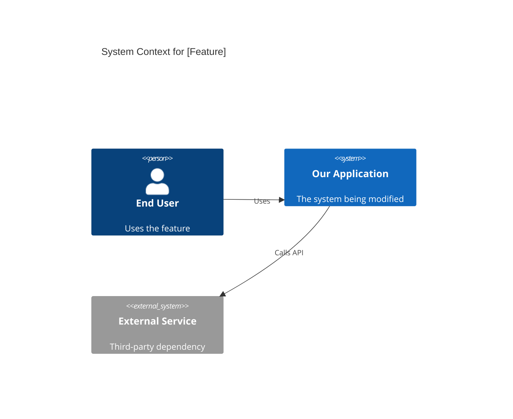
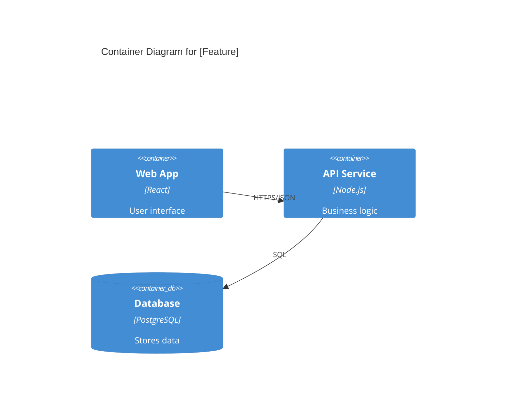

# Team Workflow Standard: AI-Assisted Development

> **Goal**: Prevent 10,000-line PRs by front-loading planning rigor. Every feature should decompose into ~200-400 line PRs that are reviewable in one sitting.

---

## The Core Problem

When agents receive vague or large-scoped tickets, they generate monolithic changes. The solution is **constraint-driven planning** before code generation begins.

---

## Phase 1: Ticket Creation Process

### Step 1: PRD (Product Requirements Document)

**When**: Before grooming session
**Who**: PM or feature owner
**Format**: Markdown file in repo under `/docs/prd/`

```markdown
# PRD: [Feature Name]

## Problem Statement
What user pain point are we solving? (Use "5 Whys" to get to root cause)

## User Stories
- As a [persona], I want to [action], so that I can [outcome]

## Success Metrics
- Leading: [What we can measure immediately]
- Lagging: [Business outcome we expect over time]

## Non-Goals (Scope Fence)
- What are we explicitly NOT building?
- Adjacent features that could creep in but shouldn't

## Open Questions
- Unresolved decisions that need grooming discussion
```

**Key Principle**: The PRD defines the *destination* (what we want), not the route (how we get there).

---

### Step 2: Technical Spec

**When**: After PRD approved, before sprint planning
**Who**: Tech lead or assigned engineer
**Format**: Markdown file in repo under `/docs/specs/`

```markdown
# Spec: [Feature Name]

## Overview
One paragraph summary of technical approach

## C4 Context Diagram (if system boundaries change)



## C4 Container Diagram (if adding/modifying services)



## Data Model Changes
- New tables/fields
- Migration strategy

## API Changes
- New endpoints
- Modified contracts

## Task Breakdown

| Task ID | Description | Est. Lines | Dependencies |
|---------|-------------|------------|--------------|
| T1 | Add database migration for X | ~50 | None |
| T2 | Create API endpoint for Y | ~150 | T1 |
| T3 | Build UI component for Z | ~200 | T2 |
| T4 | Integration tests | ~100 | T3 |

## Risks & Mitigations
- What could go wrong?
- How do we detect/recover?
```

**Key Principle**: The spec defines the *route* and breaks it into reviewable chunks. Each task should target ~200-400 lines.

---

### Step 3: Jira Ticket Structure

**Hierarchy**:
```
Epic (Feature)
  └── Story (User-facing capability)
        └── Task (Single PR, ~200-400 lines)
```

**Task Ticket Template**:
```
Title: [T1] Add database migration for user_preferences table

## Link to Spec
/docs/specs/feature-name.md#task-breakdown

## Acceptance Criteria
- [ ] Migration creates user_preferences table with columns: id, user_id, theme, notifications
- [ ] Rollback migration exists and is tested
- [ ] No data loss for existing users

## Technical Notes
- Reference the spec's Data Model section
- Follows existing migration naming convention

## Definition of Done
- [ ] PR ≤ 400 lines
- [ ] Tests pass
- [ ] Migration tested locally both up and down
```

---

## Phase 2: Sprint Ceremonies

### Backlog Grooming (Architecture Review Gate)

**Checklist before ticket enters sprint**:
- [ ] PRD exists and is approved
- [ ] Spec exists with C4 diagrams (if system changes)
- [ ] Tasks are broken down to ~200-400 line chunks
- [ ] Dependencies between tasks are mapped
- [ ] Non-functional requirements defined (latency, security)

**Grooming Discussion Points**:
1. Review C4 diagrams for architectural concerns
2. Validate task decomposition is appropriately sized
3. Identify cross-team dependencies
4. Estimate points per task (not per story)

### Sprint Planning

**Ticket Requirements**:
- Only take tasks with approved specs
- Assign tasks respecting dependency order
- Verify T-shirt sizing maps to 200-400 line target

---

## Phase 3: PR Review Process

### For Trivial Changes (bug fixes, config tweaks)

Standard code review - no special process needed.

### For Feature Work (anything with a spec)

**PR Template**:
```markdown
## Summary
- Brief description of what changed

## Link to Spec
/docs/specs/feature-name.md

## Task Reference
Completes task T2 from the spec

## Visual Changes (if applicable)
[Screenshot or diagram]

## C4 Diagram Update (if architecture changed)
[Updated Mermaid diagram showing delta]

## Test Plan
- [ ] Unit tests added/updated
- [ ] Integration test coverage
- [ ] Manual testing steps

## Checklist
- [ ] PR is ≤ 400 lines
- [ ] Spec link included
- [ ] Self-review completed
```

### Automated PR Checks

Configure CI to:
1. **Size Gate**: Warn if PR > 400 lines, block if > 800 lines
2. **Spec Link Check**: Require `/docs/specs/` link for feature branches
3. **Architecture Lint**: Validate dependency rules (e.g., domain layer doesn't import infrastructure)

### AI-Assisted Review (Optional Enhancement)

For complex PRs, generate:
1. **Change Summary**: 3-5 bullet points of what changed
2. **Risk Callouts**: Potential issues flagged
3. **Diagram Diff**: Show before/after C4 if architecture changed

---

## Quick Reference: The 200-400 Line Rule

| If PR is... | Action |
|-------------|--------|
| < 200 lines | Good - might combine with related task |
| 200-400 lines | Ideal - reviewable in one sitting |
| 400-800 lines | Warning - consider splitting |
| > 800 lines | Block - must decompose further |

**Exception**: Large refactors or migrations may exceed limits with explicit tech lead approval, but must include comprehensive automated tests.

---

## Adoption Roadmap

| Week | Focus | Action |
|------|-------|--------|
| 1 | **Specs** | Create `/docs/prd/` and `/docs/specs/` directories. Write first PRD/Spec for upcoming feature. |
| 2 | **Diagrams** | Require C4 Mermaid diagram for any system-level change |
| 3 | **Task Sizing** | Enforce task breakdown with line estimates in specs |
| 4 | **PR Gates** | Add CI checks for PR size and spec links |

---

## Templates Directory

Create these files in your repo:
- `/docs/templates/prd-template.md`
- `/docs/templates/spec-template.md`
- `/.github/PULL_REQUEST_TEMPLATE.md`

---

## Metrics to Track

| Metric | Target | Why |
|--------|--------|-----|
| Avg PR size | < 400 lines | Reviewability |
| PRs per story | 2-5 | Proper decomposition |
| Time to merge | < 24 hours | Review bottleneck indicator |
| Spec coverage | 100% for features | Planning discipline |
