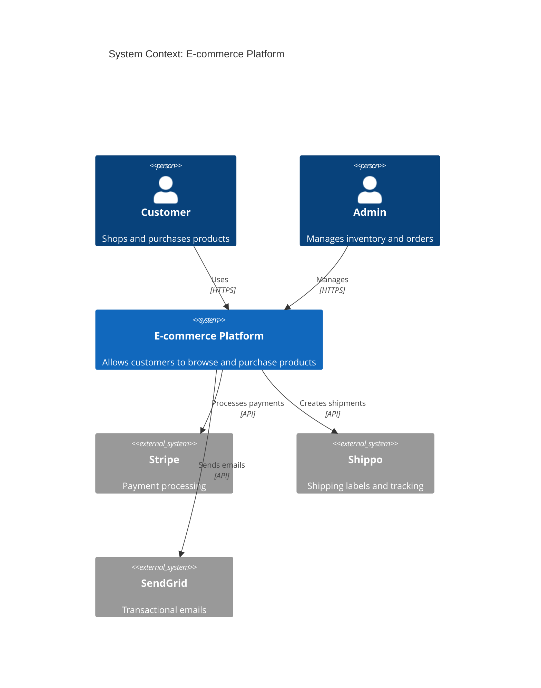
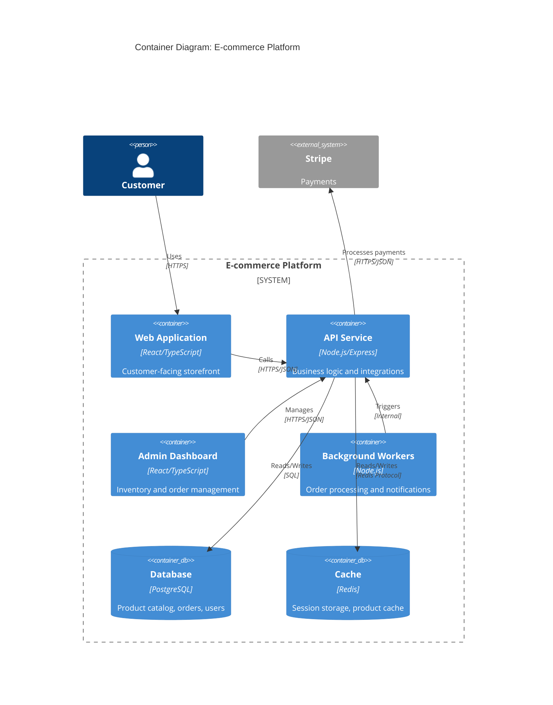
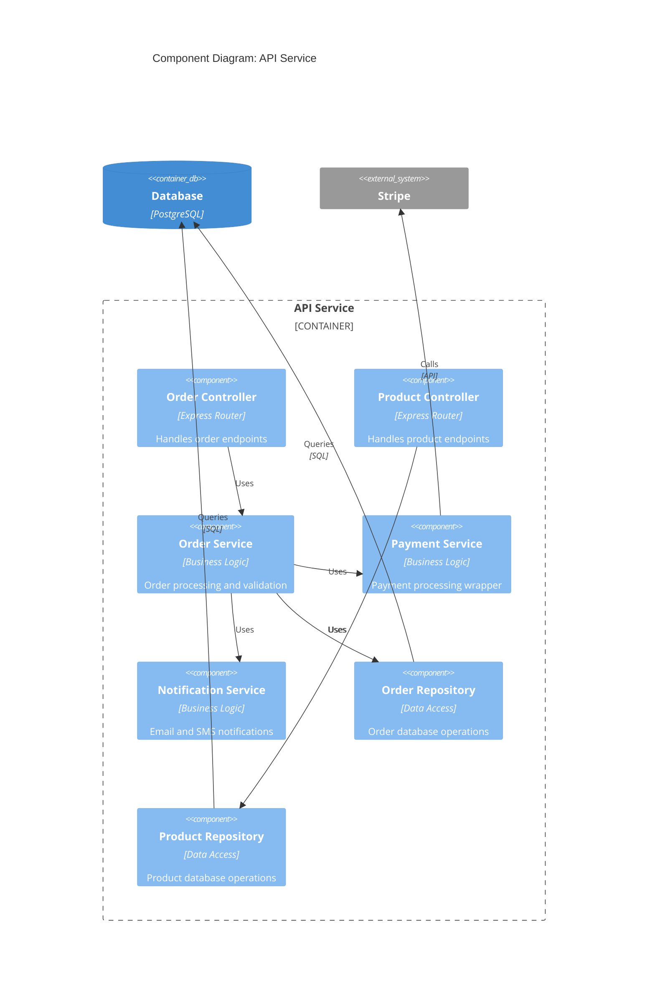
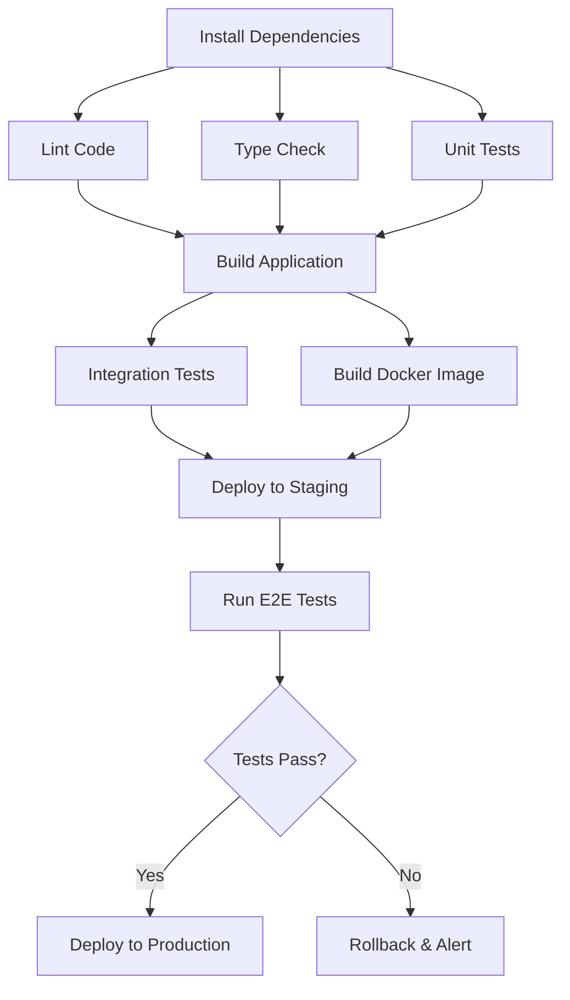
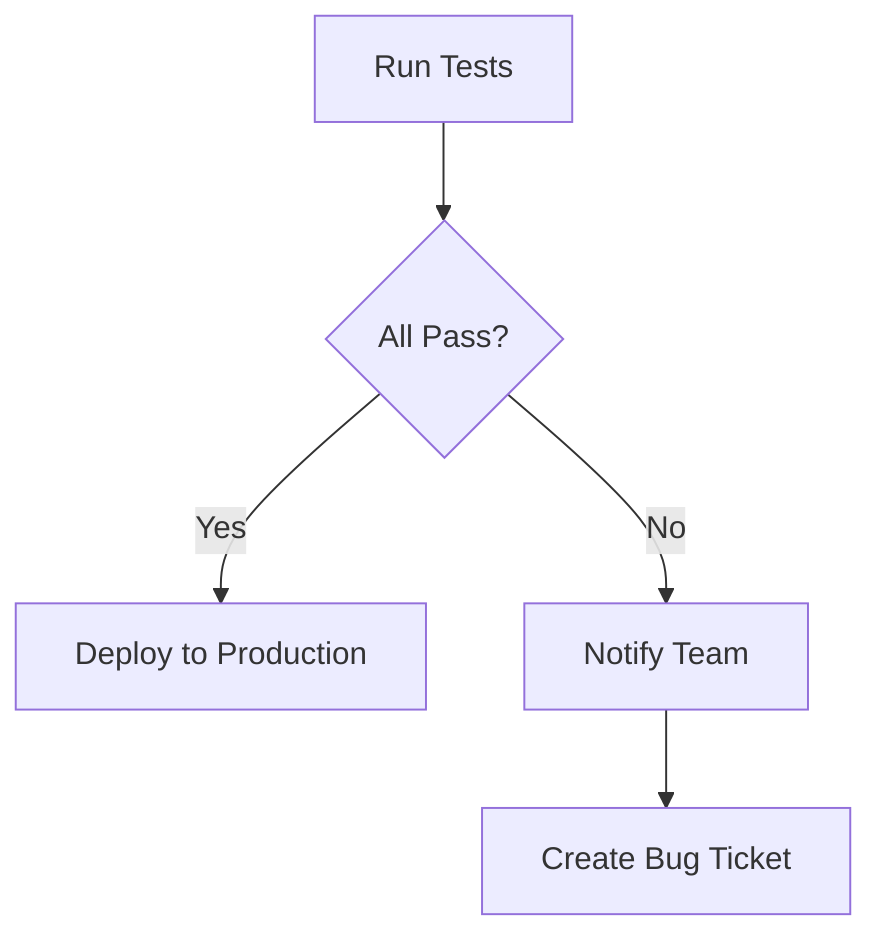
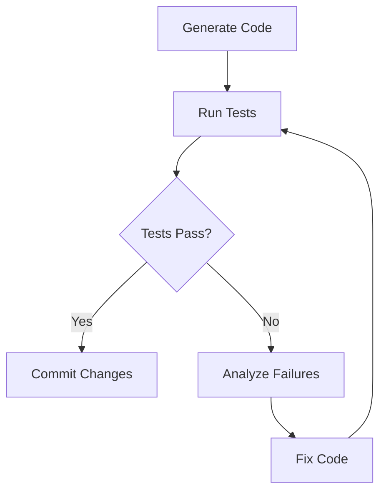
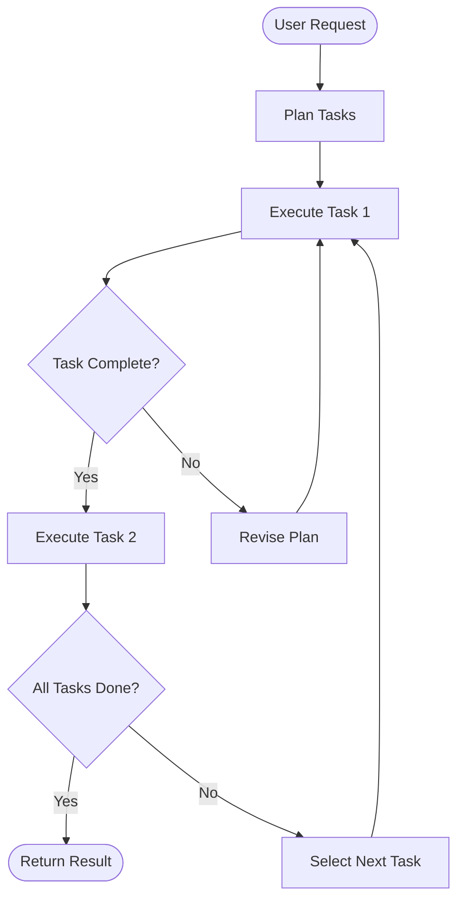

# Visuals & Diagrams Guide

Visual diagrams are essential tools for communicating both high-level architectural structure and low-level execution logic. They serve different audiences—from CEOs understanding system boundaries to developers implementing specific components—and LLMs make them easier than ever to generate.

## The C4 Model: Architectural Hierarchy

The [C4 Model](https://c4model.com/) provides a hierarchical approach to software architecture diagrams, allowing you to zoom in and out depending on your audience and purpose. Think of it as a "map" for your software system.

### Level 1: System Context

The highest level view shows your system as a single box, focusing on its interactions with users and external systems.

**Audience:** Executives, product managers, non-technical stakeholders

**Shows:**
- The system boundary (what's inside vs. outside)
- User personas interacting with the system
- External dependencies (Stripe, AWS, Auth0, etc.)
- Data flows between systems

**Example:**


### Level 2: Containers

Zoom into your system to show the high-level technical building blocks (applications, databases, file systems).

**Audience:** Technical leads, architects, cross-team collaboration

**Shows:**
- Web applications, mobile apps, background workers
- Databases and data stores
- Technology choices (React, Node.js, PostgreSQL)
- Communication protocols between containers

**Example:**


### Level 3: Components

Zoom into a single container to show its internal logical components (controllers, services, repositories).

**Audience:** Developers implementing or refactoring the container

**Shows:**
- Major classes/modules and their responsibilities
- Component dependencies within the container
- Design patterns (MVC, layered architecture)
- Internal APIs and interfaces

**Example:**


### Level 4: Code

The most granular view shows classes, interfaces, and their relationships (UML class diagrams, ER diagrams).

**Audience:** Developers working on specific modules

**Shows:**
- Class/interface definitions
- Methods and properties
- Inheritance and composition relationships
- Database schemas (ER diagrams)

**Note:** In modern agile development, Level 4 diagrams are often omitted or auto-generated from code since they become outdated quickly and the code itself serves as the source of truth.

---

## Task Graphs: Execution Flow

While C4 diagrams show system structure, **Task Graphs** (also called Directed Acyclic Graphs or DAGs) represent operational workflows with dependencies, parallelism, and conditional logic.

### What Are Task Graphs?

A task graph is a visual representation of work broken down into discrete tasks with explicit dependencies and execution order.

**Example: CI/CD Pipeline**


### Key Concepts

#### Parallelism

Independent tasks can run simultaneously to save time. In the example above, linting, type checking, and unit tests all run in parallel after dependencies are installed.

**Benefits:**
- Faster execution (3 tasks in parallel vs. sequential)
- Better resource utilization
- Clear visualization of what can be parallelized

#### Conditionals

Tasks can branch based on outcomes: "If Task A succeeds, do Task B; if it fails, do Task C."



#### Cycles and Loops

Some workflows need retry logic or iterative refinement until conditions are met. This is especially common in AI agent workflows where the agent self-corrects.

**Example: AI Agent Self-Correction**


### Task Graphs in AI Agentic Frameworks

Modern AI frameworks use task graphs to orchestrate complex workflows:

- **[LangGraph](https://github.com/langchain-ai/langgraph)**: Builds stateful, multi-actor applications with cyclic graphs for agent workflows
- **[CrewAI](https://github.com/joaomdmoura/crewAI)**: Orchestrates role-playing AI agents with sequential and hierarchical task execution
- **[AutoGen](https://github.com/microsoft/autogen)**: Enables multi-agent conversations with conditional logic and tool use

**Example LangGraph Workflow:**


---

## Why LLMs Excel at Generating Diagrams

LLMs are particularly good at creating visual diagrams from natural language descriptions because:

### 1. Structured Syntax with Natural Context

Mermaid and PlantUML use simple, readable syntax that resembles natural language:

```
User -> System: Login
System -> Database: Validate credentials
Database -> System: Return user data
System -> User: Show dashboard
```

LLMs understand both the formal syntax and the conceptual relationships being described.

### 2. Pattern Recognition

LLMs have seen thousands of architecture diagrams in their training data and can recognize common patterns:
- Microservices architecture
- Layered architecture (presentation, business logic, data access)
- Event-driven systems
- API gateway patterns

When you describe your system, the LLM maps it to known patterns and generates appropriate visualizations.

### 3. Automatic Abstraction

LLMs can automatically choose the right level of detail based on context:

**Request:** "Show me a high-level architecture diagram for an e-commerce platform"
→ Generates a Level 1 C4 Context diagram

**Request:** "Show the internal components of the API service"
→ Generates a Level 3 C4 Component diagram

### 4. Iteration and Refinement

You can refine diagrams conversationally:

- "Add a Redis cache between the API and database"
- "Show the payment flow as a sequence diagram"
- "Highlight the components affected by this feature"

The LLM updates the diagram incrementally without starting from scratch.

### How to Use LLMs for Diagram Generation

**Be specific about what you want to visualize:**
```
Create a C4 Container diagram showing:
- A React web app
- A Node.js API service
- A PostgreSQL database
- A Redis cache
- External integration with Stripe for payments
```

**Specify the diagram type:**
- C4 Context/Container/Component diagrams
- Sequence diagrams (for interactions over time)
- State diagrams (for state machines)
- Entity-relationship diagrams (for database schemas)
- Flow charts (for decision logic)

**Iterate to refine:**
- "Make the database connection bidirectional"
- "Add labels showing which protocol is used"
- "Group the services into a system boundary box"

### Tools for Rendering Diagrams

- **[Mermaid](https://mermaid.js.org/)**: JavaScript-based, renders in Markdown (GitHub, Notion, docs)
- **[PlantUML](https://plantuml.com/)**: Java-based, extensive diagram types
- **[Structurizr](https://structurizr.com/)**: C4 Model-specific tooling with DSL
- **[Excalidraw](https://excalidraw.com/)**: Hand-drawn style for informal diagrams
- **[Lucidchart](https://lucidchart.com/)**, **[Draw.io](https://draw.io/)**: Visual editors for manual creation

---

## When to Use Which Diagram

| Purpose | Diagram Type | Best For |
|---------|-------------|----------|
| Show system boundaries and external dependencies | C4 Context | Executive reviews, RFPs, onboarding |
| Document technical architecture | C4 Container | Architecture reviews, cross-team alignment |
| Plan component design before coding | C4 Component | Technical specs, implementation planning |
| Visualize request/response flows | Sequence Diagram | API design, debugging race conditions |
| Define task dependencies | Task Graph (DAG) | Sprint planning, CI/CD pipelines, agent workflows |
| Document decision logic | Flowchart | Business logic, approval workflows |
| Design database schema | ER Diagram | Database migrations, data modeling |

---

## Integration with This Repo's Workflow

Both Solution 1 (Spec Kit) and Solution 2 (Manual Templates) emphasize visual diagrams:

### Solution 1: Spec Kit
- Uses `/speckit.plan` to generate C4 diagrams automatically
- Stores diagrams in `.specify/specs/{feature}/` directory
- Updates diagrams as the plan evolves

### Solution 2: Manual Templates
- Includes C4 diagram sections in [`templates/spec-template.md`](../templates/spec-template.md)
- Examples in [`examples/spec-chatbot-workflows.md`](../examples/spec-chatbot-workflows.md)
- Diagrams help reviewers understand architecture before diving into code

**Both approaches produce small PRs because the diagram acts as a map showing how the work should be decomposed.**

---

## Alternative Tools

For teams wanting to go deeper with architecture documentation and diagramming tools, see our comprehensive [Architecture Tools Reference](./architecture-tools.md), which covers:

- Modern C4 tools (LikeC4, Structurizr, IcePanel)
- Alternative diagramming languages (D2, PlantUML, Diagrams for Python)
- Architecture Decision Records (ADR Tools, Log4brains)
- Documentation frameworks (arc42)
- AI-powered diagram generation (Eraser DiagramGPT, Swark)
- Tool comparison matrices and selection guidance

---

## Further Reading

- **[C4 Model Official Site](https://c4model.com/)** - Complete C4 methodology
- **[Mermaid Documentation](https://mermaid.js.org/intro/)** - Diagram syntax reference
- **[LangGraph Documentation](https://langchain-ai.github.io/langgraph/)** - Agent workflow graphs
- **[Visualizing Software Architecture](https://www.amazon.com/dp/1680502891)** by Simon Brown - Book on C4 Model
