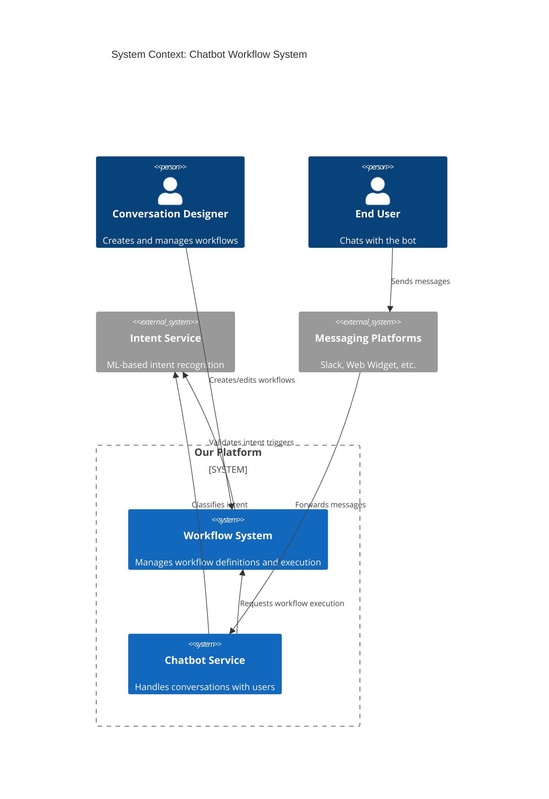
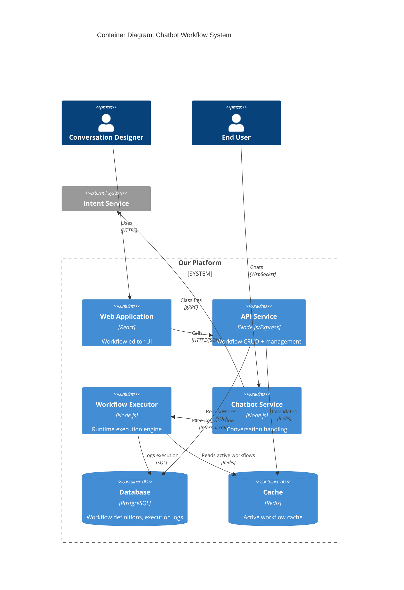
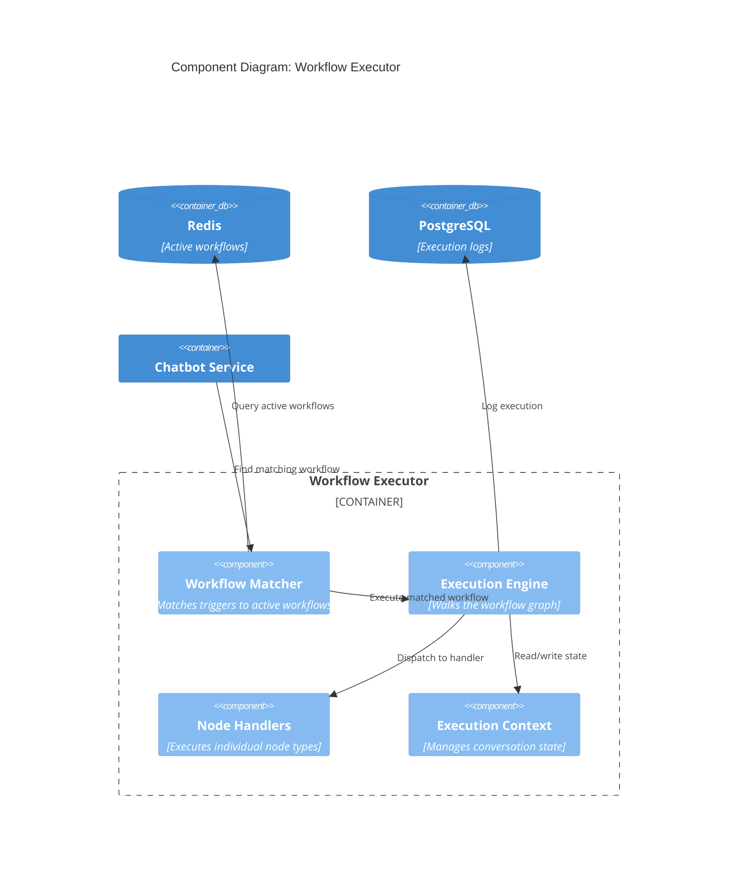
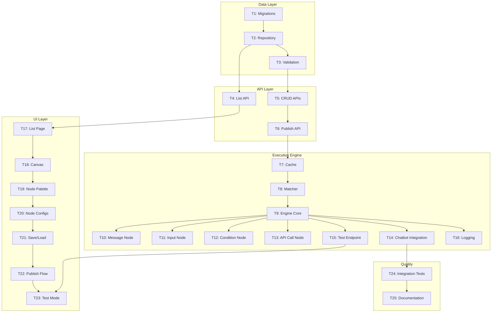

# Technical Spec: Custom Chatbot Workflows

> **Status**: Draft
> **Author**: [Tech Lead Name]
> **PRD Link**: `/docs/prd/chatbot-workflows.md`
> **Last Updated**: 2026-01-21

---

## Overview

We're building a workflow system that allows conversation designers to create, edit, and publish chatbot conversation flows without engineering involvement. The system consists of three main components: (1) a visual workflow editor UI, (2) a workflow storage and management API, and (3) a runtime execution engine that integrates with the existing chatbot pipeline.

The workflow model uses a directed graph structure where nodes represent actions (send message, collect input, call API, branch on condition) and edges represent transitions between actions.

---

## Architecture

### C4 Context Diagram



### C4 Container Diagram



### Component Diagram: Workflow Executor



---

## Data Model

### Core Tables

```sql
-- Workflow definition (the saved workflow)
CREATE TABLE workflows (
    id UUID PRIMARY KEY DEFAULT gen_random_uuid(),
    tenant_id UUID NOT NULL REFERENCES tenants(id),
    name VARCHAR(255) NOT NULL,
    description TEXT,
    trigger_type VARCHAR(50) NOT NULL, -- 'intent_match', 'keyword_contains', 'conversation_start'
    trigger_config JSONB NOT NULL,      -- {"intent": "ask_faq"} or {"keywords": ["help", "support"]}
    priority INTEGER DEFAULT 0,         -- Higher = evaluated first
    status VARCHAR(20) DEFAULT 'draft', -- 'draft', 'active', 'archived'
    graph JSONB NOT NULL,               -- The workflow graph (nodes + edges)
    created_by UUID REFERENCES users(id),
    created_at TIMESTAMPTZ DEFAULT NOW(),
    updated_at TIMESTAMPTZ DEFAULT NOW(),
    published_at TIMESTAMPTZ,
    published_by UUID REFERENCES users(id),

    CONSTRAINT unique_workflow_name_per_tenant UNIQUE (tenant_id, name)
);

CREATE INDEX idx_workflows_tenant_status ON workflows(tenant_id, status);
CREATE INDEX idx_workflows_trigger ON workflows(tenant_id, trigger_type) WHERE status = 'active';

-- Workflow versions (for rollback)
CREATE TABLE workflow_versions (
    id UUID PRIMARY KEY DEFAULT gen_random_uuid(),
    workflow_id UUID NOT NULL REFERENCES workflows(id) ON DELETE CASCADE,
    version INTEGER NOT NULL,
    graph JSONB NOT NULL,
    trigger_config JSONB NOT NULL,
    created_at TIMESTAMPTZ DEFAULT NOW(),
    created_by UUID REFERENCES users(id),

    CONSTRAINT unique_version UNIQUE (workflow_id, version)
);

-- Execution logs (for debugging)
CREATE TABLE workflow_executions (
    id UUID PRIMARY KEY DEFAULT gen_random_uuid(),
    workflow_id UUID NOT NULL REFERENCES workflows(id),
    conversation_id UUID NOT NULL,
    started_at TIMESTAMPTZ DEFAULT NOW(),
    completed_at TIMESTAMPTZ,
    status VARCHAR(20) NOT NULL, -- 'running', 'completed', 'failed', 'timeout'
    execution_path JSONB,        -- Array of node IDs executed
    error_message TEXT,

    -- Partition by month for performance
    created_at TIMESTAMPTZ DEFAULT NOW()
) PARTITION BY RANGE (created_at);

CREATE INDEX idx_executions_conversation ON workflow_executions(conversation_id);
CREATE INDEX idx_executions_workflow ON workflow_executions(workflow_id, created_at);
```

### Workflow Graph Schema (JSONB)

```typescript
interface WorkflowGraph {
  nodes: WorkflowNode[];
  edges: WorkflowEdge[];
  startNodeId: string;
}

interface WorkflowNode {
  id: string;
  type: 'message' | 'input' | 'condition' | 'api_call' | 'end';
  position: { x: number; y: number }; // For editor layout
  data: MessageNodeData | InputNodeData | ConditionNodeData | ApiCallNodeData;
}

interface WorkflowEdge {
  id: string;
  source: string;      // Source node ID
  target: string;      // Target node ID
  sourceHandle?: string; // For condition nodes: 'true' | 'false'
}

// Node data types
interface MessageNodeData {
  message: string;           // Supports {{variable}} interpolation
  delay_ms?: number;         // Optional typing delay
}

interface InputNodeData {
  prompt: string;
  variable_name: string;     // Store response in this variable
  validation?: {
    type: 'text' | 'email' | 'number' | 'choice';
    choices?: string[];      // For choice type
    error_message?: string;
  };
}

interface ConditionNodeData {
  left_operand: string;      // Variable name or literal
  operator: 'equals' | 'contains' | 'greater_than' | 'less_than' | 'is_empty';
  right_operand: string;
}

interface ApiCallNodeData {
  url: string;
  method: 'GET' | 'POST';
  headers?: Record<string, string>;
  body_template?: string;    // JSON template with {{variables}}
  response_variable: string; // Store response in this variable
  timeout_ms: number;
  on_error: 'continue' | 'fail';
}
```

---

## API Design

### Workflow CRUD Endpoints

#### `GET /api/v1/workflows`

List workflows for current tenant.

**Query Parameters**:
- `status`: Filter by status (draft, active, archived)
- `search`: Search by name
- `page`, `limit`: Pagination

**Response** (200):
```json
{
  "data": [
    {
      "id": "uuid",
      "name": "Welcome Flow",
      "description": "Greets new users",
      "trigger_type": "conversation_start",
      "status": "active",
      "updated_at": "2026-01-21T00:00:00Z"
    }
  ],
  "pagination": {
    "page": 1,
    "limit": 20,
    "total": 45
  }
}
```

#### `POST /api/v1/workflows`

Create a new workflow.

**Request**:
```json
{
  "name": "FAQ Handler",
  "description": "Handles FAQ-related questions",
  "trigger_type": "intent_match",
  "trigger_config": { "intent": "ask_faq" },
  "priority": 10,
  "graph": {
    "nodes": [...],
    "edges": [...],
    "startNodeId": "node-1"
  }
}
```

**Response** (201): Full workflow object

#### `PUT /api/v1/workflows/:id`

Update workflow (must be in draft status or will create new version).

#### `POST /api/v1/workflows/:id/publish`

Publish a draft workflow (makes it active).

**Response** (200):
```json
{
  "id": "uuid",
  "status": "active",
  "published_at": "2026-01-21T00:00:00Z",
  "version": 3
}
```

#### `POST /api/v1/workflows/:id/unpublish`

Unpublish (set to draft).

#### `POST /api/v1/workflows/:id/duplicate`

Create a copy of the workflow.

#### `POST /api/v1/workflows/:id/test`

Test workflow execution with simulated input.

**Request**:
```json
{
  "simulated_message": "I need help with my account",
  "simulated_context": {
    "user_name": "Test User"
  }
}
```

**Response** (200):
```json
{
  "matched": true,
  "execution_path": ["node-1", "node-2", "node-3"],
  "responses": [
    { "type": "message", "content": "Hi Test User! How can I help?" },
    { "type": "input_request", "prompt": "What's your account number?" }
  ],
  "final_context": { "user_name": "Test User" },
  "execution_time_ms": 45
}
```

---

## Task Breakdown

| ID | Task | Description | Est. Lines | Dependencies | Priority |
|----|------|-------------|------------|--------------|----------|
| **T1** | Database migrations | Create workflows, workflow_versions, workflow_executions tables | ~100 | None | P0 |
| **T2** | Workflow repository | CRUD operations for workflow storage | ~200 | T1 | P0 |
| **T3** | Workflow validation | Validate graph structure, trigger config | ~150 | T2 | P0 |
| **T4** | List/Search API | GET /workflows with filtering and pagination | ~150 | T2 | P0 |
| **T5** | CRUD APIs | POST/PUT/DELETE workflow endpoints | ~200 | T3 | P0 |
| **T6** | Publish/Unpublish API | Status transitions + versioning | ~150 | T5 | P0 |
| **T7** | Workflow cache layer | Redis cache for active workflows | ~100 | T6 | P0 |
| **T8** | Workflow Matcher | Find matching workflow for trigger | ~150 | T7 | P0 |
| **T9** | Execution Engine core | Graph walker, context management | ~250 | T8 | P0 |
| **T10** | Message node handler | Execute message nodes | ~80 | T9 | P0 |
| **T11** | Input node handler | Execute input collection nodes | ~100 | T9 | P0 |
| **T12** | Condition node handler | Execute branching logic | ~100 | T9 | P0 |
| **T13** | API Call node handler | Execute external API calls | ~150 | T9 | P1 |
| **T14** | Chatbot integration | Hook executor into message pipeline | ~150 | T9 | P0 |
| **T15** | Test endpoint | Simulate workflow execution | ~150 | T9 | P1 |
| **T16** | Execution logging | Log executions for debugging | ~100 | T9 | P1 |
| **T17** | UI: Workflow list page | List, search, filter workflows | ~300 | T4 | P0 |
| **T18** | UI: Editor - Canvas | React Flow canvas setup | ~250 | T17 | P0 |
| **T19** | UI: Editor - Node palette | Draggable node types | ~150 | T18 | P0 |
| **T20** | UI: Editor - Node configs | Config panels for each node type | ~300 | T19 | P0 |
| **T21** | UI: Editor - Save/Load | Persist workflow to API | ~150 | T20 | P0 |
| **T22** | UI: Publish flow | Publish button + confirmation | ~100 | T21 | P0 |
| **T23** | UI: Test mode | Test panel with simulated chat | ~250 | T15, T22 | P1 |
| **T24** | Integration tests | E2E workflow creation + execution | ~300 | T14 | P0 |
| **T25** | Documentation | API docs + user guide | ~150 | T24 | P1 |

**Total Estimated**: ~4,035 lines across 25 PRs

### Task Dependency Graph



### Sprint Planning Suggestion

**Sprint 1 (Foundation)**:
- T1, T2, T3, T4, T5, T6 (Data + API Layer)
- Outcome: Can create/save workflows via API

**Sprint 2 (Execution)**:
- T7, T8, T9, T10, T11, T12, T14
- Outcome: Workflows execute in chatbot

**Sprint 3 (UI - Editor)**:
- T17, T18, T19, T20, T21
- Outcome: Visual editor functional

**Sprint 4 (Polish)**:
- T13, T15, T16, T22, T23, T24, T25
- Outcome: API calls, testing, logging, docs

---

## Security Considerations

| Concern | Mitigation |
|---------|------------|
| Authorization | RBAC: `workflow:read`, `workflow:write`, `workflow:publish` permissions |
| API Call node abuse | Allowlist of approved external domains; rate limiting per workflow |
| Injection in message templates | Sanitize `{{variable}}` interpolation; no code execution |
| Workflow validation | Validate graph is acyclic; all nodes reachable; no infinite loops |

---

## Performance Considerations

| Metric | Target | Approach |
|--------|--------|----------|
| Workflow matching | < 10ms | Redis cache with tenant-partitioned keys |
| Single node execution | < 20ms | Async handlers, connection pooling for API calls |
| Total workflow overhead | < 50ms | Warm cache, precompiled condition evaluators |
| Editor save latency | < 500ms | Optimistic UI updates |

---

## Risks & Mitigations

| Risk | Likelihood | Impact | Mitigation |
|------|------------|--------|------------|
| Complex workflows cause slow responses | Medium | High | Enforce max 50 nodes per workflow; timeout at 5s |
| Invalid workflow crashes chatbot | Low | Critical | Executor catches all errors; falls back to default behavior |
| Cache inconsistency after publish | Low | Medium | Cache invalidation on publish; TTL as backup |
| React Flow performance with large graphs | Medium | Medium | Virtualization; warn at 30+ nodes |

---

## Open Questions / Decisions Needed

- [x] **Resolved**: Priority order = higher priority number wins, then most recently published
- [ ] **Pending**: Should workflow variables persist across conversations or reset each time?
- [ ] **Pending**: Do we need workflow-level analytics in MVP or defer to Phase 2?
