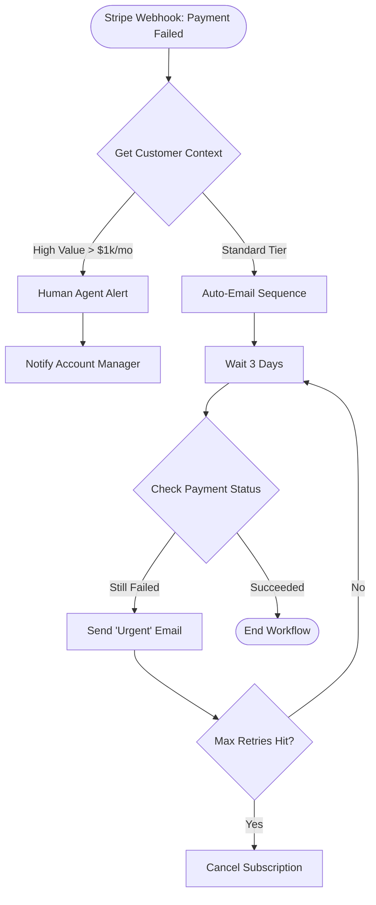

# PRD vs Task Graph

A **Task Graph** (often used in AI engineering tools like LangGraph or workflow engines like Airflow) is a visualization of the *execution logic*.

While the **PRD** describes the **destination** (what we want to achieve), the **Task Graph** describes the **route** (the exact steps, loops, and conditions to get there).

---

## Example: Stripe Dunning Task Graph

This is what a Task Graph looks like. It is a Directed Acyclic Graph (DAG) representing the flow of data and decisions.

---

## The Breakdown

In this graph, you aren't reading paragraphs about "user needs." You are looking at **Nodes** (actions) and **Edges** (conditional logic).

- **Nodes:** The boxes (e.g., `Notify Account Manager`, `Wait 3 Days`). These are specific functions or AI agents performing work.
- **Edges:** The arrows. They define the dependency. `Wait 3 Days` *must* happen before `Check Payment Status`.
- **Conditionals:** The diamonds. The logic that splits the path (e.g., Is this a VIP customer? Did the payment succeed?).

---

## Comparison: PRD vs Task Graph

| Feature | PRD (The "What") | Task Graph (The "How") |
|---------|------------------|------------------------|
| **Audience** | Stakeholders, PMs, Designers | Engineers, AI Agents, Workflow Engines |
| **Format** | Text, Tables, User Stories | Flowcharts, DAGs, JSON/Python Code |
| **Example Content** | *"As a roadmap owner, I want high-value customers to receive personal outreach so they don't feel spammed."* | `if customer_LTV > 1000: return Node_Slack_Alert else: return Node_Email_Seq` |
| **Focus** | Outcome: Preventing Churn | Logic: Handling state, retries, and errors |
| **Change Frequency** | Low (strategic goals rarely change) | High (tweak retry logic, prompt phrasing, etc.) |

---

## When to Use Which

1. **Write the PRD first.** It ensures you know *why* you are building the dunning bot (e.g., "Recover 10% of failed revenue").

2. **Design the Task Graph second.** This is your technical spec. If you build the graph without the PRD, you might build a complex "Cancel Subscription" node only to realize later that the business team *never* wants to auto-cancel VIPs.
