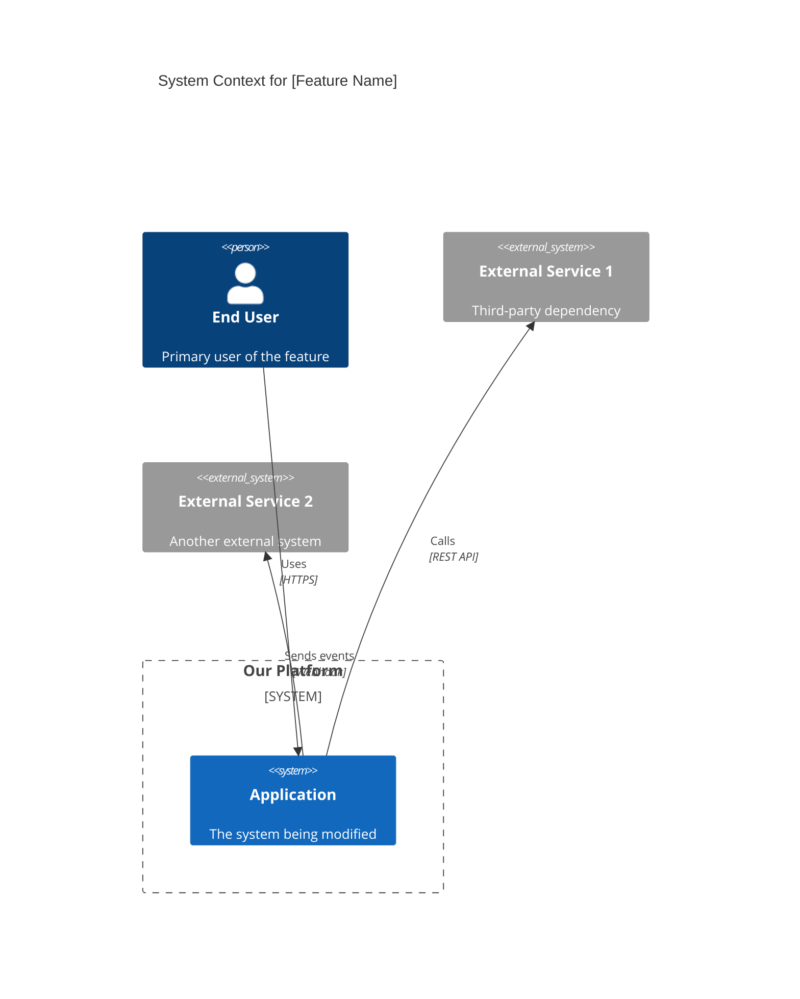
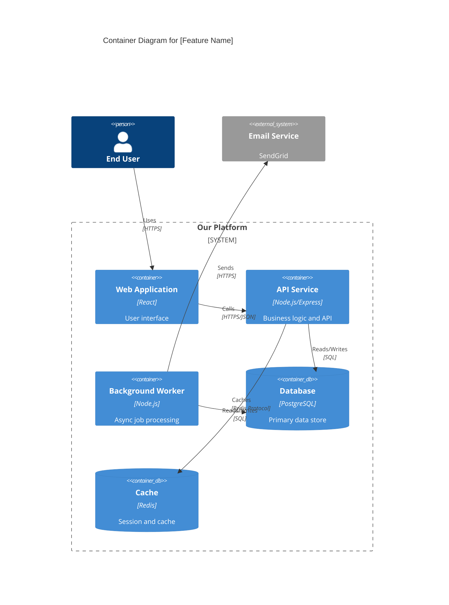
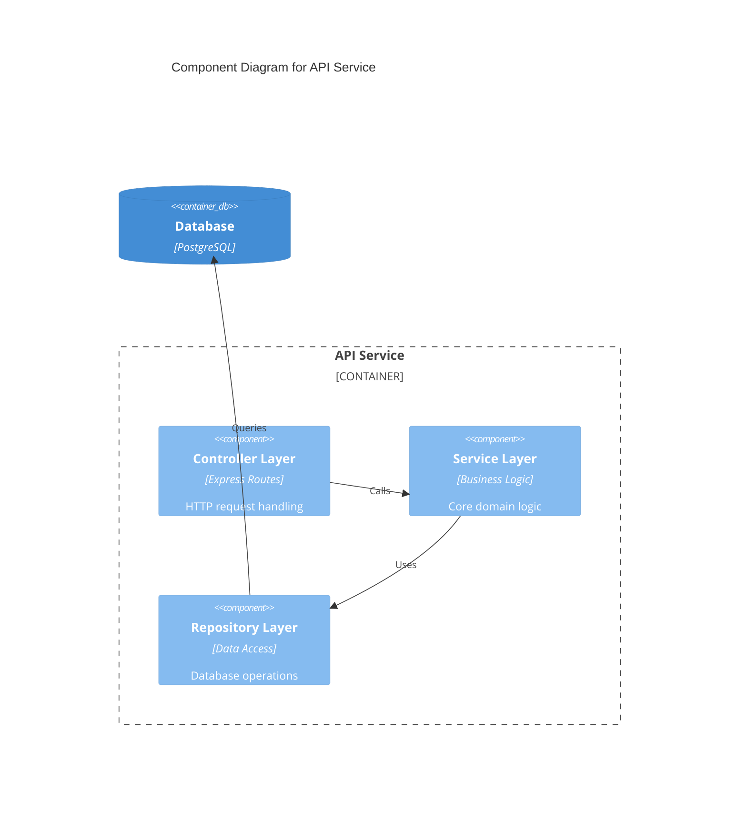
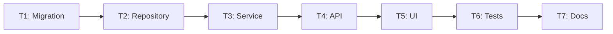

# Technical Spec: [Feature Name]

> **Status**: Draft | In Review | Approved
> **Author**: [Name]
> **PRD Link**: [Link to PRD]
> **Last Updated**: [Date]

---

## Overview

[1-2 paragraph summary of the technical approach. What are we building and at a high level, how?]

---

## Architecture

### C4 Context Diagram

> Show how this feature fits into the broader system landscape.



### C4 Container Diagram

> Show the containers (applications/services) involved and how they interact.



### Component Diagram (if needed for complex services)



---

## Data Model

### New Tables/Collections

```sql
-- Example: New table for feature
CREATE TABLE user_preferences (
    id UUID PRIMARY KEY DEFAULT gen_random_uuid(),
    user_id UUID NOT NULL REFERENCES users(id) ON DELETE CASCADE,
    theme VARCHAR(20) DEFAULT 'light',
    notifications_enabled BOOLEAN DEFAULT true,
    created_at TIMESTAMP WITH TIME ZONE DEFAULT NOW(),
    updated_at TIMESTAMP WITH TIME ZONE DEFAULT NOW()
);

CREATE INDEX idx_user_preferences_user_id ON user_preferences(user_id);
```

### Schema Changes to Existing Tables

| Table | Column | Change | Migration Notes |
|-------|--------|--------|-----------------|
| [table] | [column] | ADD/MODIFY/DROP | [Backward compatibility notes] |

### Migration Strategy

- [ ] Migration is backward compatible (can deploy code before migration)
- [ ] Rollback migration tested
- [ ] Data backfill plan (if applicable)

---

## API Design

### New Endpoints

#### `POST /api/v1/resource`

**Request**:
```json
{
  "field1": "string",
  "field2": 123
}
```

**Response** (201 Created):
```json
{
  "id": "uuid",
  "field1": "string",
  "field2": 123,
  "createdAt": "2026-01-21T00:00:00Z"
}
```

**Errors**:
| Status | Code | Description |
|--------|------|-------------|
| 400 | INVALID_INPUT | Validation failed |
| 401 | UNAUTHORIZED | Missing/invalid auth |
| 409 | CONFLICT | Resource already exists |

### Modified Endpoints

| Endpoint | Change | Breaking? | Migration Path |
|----------|--------|-----------|----------------|
| [endpoint] | [description] | Yes/No | [How to migrate] |

---

## Task Breakdown

> Each task should result in a PR of ~200-400 lines.

| ID | Task | Est. Lines | Dependencies | Jira |
|----|------|------------|--------------|------|
| T1 | Create database migration | ~50 | None | [Link] |
| T2 | Add repository layer for new entity | ~150 | T1 | [Link] |
| T3 | Implement service layer with business logic | ~200 | T2 | [Link] |
| T4 | Create API endpoints | ~150 | T3 | [Link] |
| T5 | Build UI components | ~300 | T4 | [Link] |
| T6 | Add integration tests | ~200 | T5 | [Link] |
| T7 | Update documentation | ~50 | T6 | [Link] |

### Task Dependency Graph



---

## Security Considerations

| Concern | Mitigation |
|---------|------------|
| Authentication | [How users are authenticated] |
| Authorization | [RBAC/permissions model] |
| Data Protection | [Encryption, PII handling] |
| Input Validation | [Sanitization approach] |

---

## Performance Considerations

| Metric | Target | Approach |
|--------|--------|----------|
| API Latency (P95) | < 200ms | [Caching strategy, query optimization] |
| Database Queries | < 5 per request | [N+1 prevention, eager loading] |
| Memory Usage | < X MB | [Pagination, streaming] |

---

## Testing Strategy

### Unit Tests
- [ ] Service layer business logic
- [ ] Repository layer (with test DB)
- [ ] Input validation

### Integration Tests
- [ ] API endpoint happy paths
- [ ] Error scenarios
- [ ] Authentication/authorization

### E2E Tests (if applicable)
- [ ] Critical user flows

---

## Rollout Plan

### Feature Flags
| Flag | Purpose | Default |
|------|---------|---------|
| `feature_x_enabled` | Gate new feature | false |

### Rollout Stages
1. **Dev**: Deploy to development, team testing
2. **Staging**: Full regression testing
3. **Production (10%)**: Canary release with monitoring
4. **Production (100%)**: Full rollout

### Rollback Plan
- How to disable if issues arise
- Data cleanup needed?

---

## Risks & Mitigations

| Risk | Likelihood | Impact | Mitigation |
|------|------------|--------|------------|
| [Risk description] | Low/Med/High | Low/Med/High | [How to prevent/detect/recover] |

---

## Open Questions / Decisions Needed

- [ ] [Technical decision that needs resolution]
- [ ] [Architecture choice pending review]

---

## References

- [Link to related documentation]
- [Link to similar implementations]
- [Link to external API docs]
